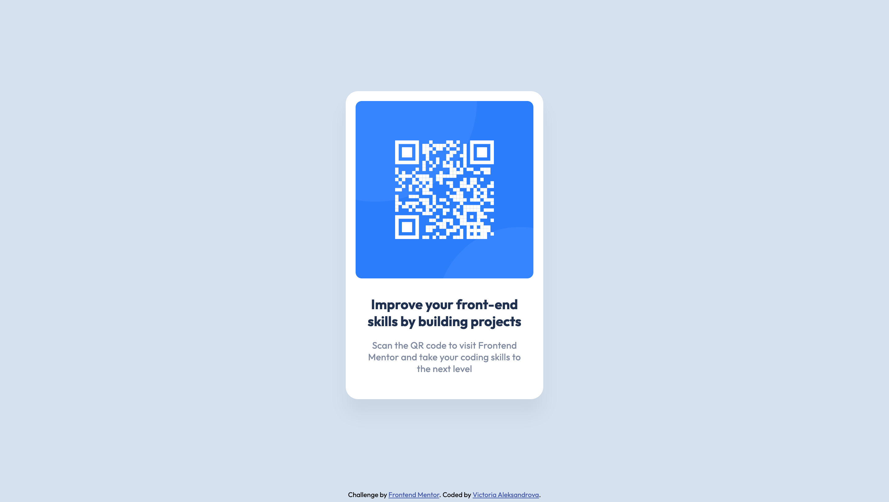

# Frontend Mentor - QR code component solution

This is a solution to the [QR code component challenge on Frontend Mentor](https://www.frontendmentor.io/challenges/qr-code-component-iux_sIO_H). Frontend Mentor challenges help you improve your coding skills by building realistic projects. 

## Table of contents

- [Overview](#overview)
  - [Screenshot](#screenshot)
  - [Links](#links)
- [My process](#my-process)
  - [Built with](#built-with)
- [Author](#author)

## Overview

My first front-end coding challenge. The card layout doesn't shift.

### Screenshot

### Links

- [Solution URL](https://www.frontendmentor.io/solutions/qr-code-component-XHFZMGWvb1)
- [Live Site URL](https://vicaleksa.github.io/QR-code-component/)

## My process

### Built with

- Flexbox

## Author

- Frontend Mentor - [@vicaleksa](https://www.frontendmentor.io/profile/vicaleksa)
- Twitter - [@vicaleksa](https://www.twitter.com/vicaleksa)
